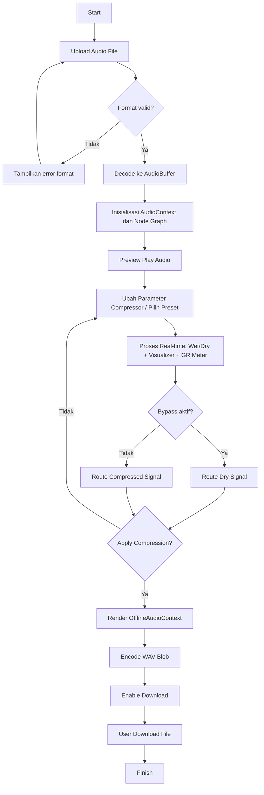
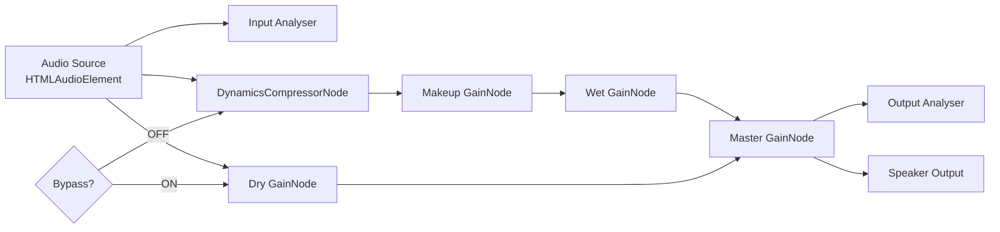

# Audio Compressor Web (SPA)

Single-page application untuk kompresi audio real-time langsung di browser menggunakan Web Audio API (DynamicsCompressorNode). Project ini dirancang dengan UI modern bertema dark neon dan pendekatan mirip plugin compressor di DAW.

## Tujuan Project

- Memproses audio tanpa upload ke server (client-side processing)
- Memberikan kontrol parameter compressor secara real-time
- Menyediakan visualisasi sinyal sebelum dan sesudah kompresi
- Memudahkan export hasil ke file WAV

## Struktur Folder

```txt
TugasPaandi/
├─ index.html   # Struktur UI (header, sidebar, visualizer, player, controls)
├─ styles.css   # Styling dark neon, glassmorphism, responsive layout
├─ app.js       # Logic Web Audio API, visualizer, presets, export WAV
└─ README.md    # Dokumentasi project
```

## Teknologi yang Digunakan

- HTML5
- CSS modern (glassmorphism + neon theme)
- JavaScript Vanilla
- Web Audio API
  - AudioContext
  - MediaElementSourceNode
  - DynamicsCompressorNode
  - GainNode
  - AnalyserNode
  - OfflineAudioContext (untuk render hasil akhir)

## Cara Menjalankan

1. Buka folder project ini.
2. Jalankan langsung file index.html di browser modern, atau gunakan local server sederhana.
3. Upload file audio dengan format MP3, WAV, OGG, atau M4A.
4. Tekan Play untuk mendengarkan preview audio.
5. Atur parameter compressor atau pilih preset.
6. Aktif/nonaktifkan Bypass untuk membandingkan sinyal original vs compressed.
7. Klik Apply Compression untuk render hasil proses.
8. Klik Download untuk menyimpan file output WAV.
9. Rekomendasi local server (opsional) agar loading file lebih stabil:

```bash
# opsi Python
python -m http.server 5500

# lalu buka
http://localhost:5500
```

## Fitur Utama

- Upload audio: MP3, WAV, OGG, M4A
- Daftar file upload di sidebar kiri
- Player control: play/pause, seek bar, volume
- Real-time compressor control:
  - Threshold (-100 sampai 0 dB)
  - Ratio (1 sampai 20)
  - Attack (0 sampai 1 detik)
  - Release (0 sampai 5 detik)
  - Knee (0 sampai 40 dB)
  - Makeup Gain (0 sampai 20 dB)
- Preset cepat: Vocal, Music, Loudness, Podcast, Aggressive
- Bypass toggle (A/B monitoring)
- Visualizer input dan output (spectrum analyzer)
- Gain reduction meter live (nilai reduction dalam dB)
- Export hasil kompresi ke format terkompresi browser-native (WebM/Opus atau OGG/Opus bila didukung, fallback ke WAV)

## Penjelasan Proses Sistem

### 1. Inisialisasi Audio Engine

Saat file dipilih dan playback dimulai, aplikasi membangun graph Web Audio:

- MediaElementSource (sumber dari elemen audio player)
- Jalur basah (wet): source -> compressor -> makeup gain -> master
- Jalur kering (dry): source -> dry gain -> master
- Analyser input/output untuk visualisasi
- Master gain untuk volume akhir

### 2. Real-time Compression

Perubahan slider langsung meng-update properti compressor node:

- threshold, ratio, attack, release, knee
- makeup gain dihitung ke skala linear: gain = 10^(dB/20)

Hasilnya, pengguna bisa mendengar perubahan karakter kompresi secara langsung saat audio diputar.

### 2.1 Formula Penting

- Konversi makeup gain dari dB ke linear:

  gain = 10^(dB/20)

- Persentase meter gain reduction (visual):

  meterPercent = clamp(abs(reductionDb) / 24 \* 100, 0, 100)

Catatan: reductionDb bernilai negatif dari node compressor (mis. -6.2 dB), sehingga dipakai nilai absolut untuk tinggi meter.

### 3. Monitoring dan Visualisasi

- Input analyzer menampilkan spektrum sinyal sebelum kompresi.
- Output analyzer menampilkan spektrum sesudah kompresi.
- Nilai gain reduction diambil dari compressor.reduction lalu divisualkan ke meter.

### 4. Apply Compression dan Export

Ketika tombol Apply Compression ditekan:

1. Buffer audio diproses ulang di OfflineAudioContext.
2. Graph offline: source -> compressor -> makeup gain -> destination.
3. Hasil render diubah ke format WAV (PCM 16-bit).
4. Blob output disiapkan untuk diunduh.

## Alur Kerja Sistem

1. User upload file audio.
2. Sistem validasi format file.
3. Sistem decode audio menjadi AudioBuffer.
4. User memutar audio untuk preview.
5. Sistem memproses audio real-time via compressor graph.
6. User menyesuaikan parameter/preset dan memantau visualizer + gain reduction.
7. User dapat menyalakan Bypass untuk perbandingan A/B.
8. User klik Apply Compression untuk render final (offline).
9. Sistem menghasilkan file WAV terkompresi.
10. User klik Download untuk menyimpan hasil.

## Flowchart Sistem



## Catatan Arsitektur Singkat

- Frontend-only: tidak ada backend, semua proses terjadi di browser
- Aman untuk privasi dasar: file audio tidak dikirim ke server
- Cocok untuk prototipe mastering/voice cleanup cepat

## Pengembangan Lanjutan

- Encoder Opus/AAC (WebCodecs atau ffmpeg.wasm) untuk file size reduction
- Menyimpan preset custom ke localStorage
- Waveform editor (zoom, marker, loop region)
- Batch compression beberapa file sekaligus
- Loudness meter LUFS + auto target level

## Flowchart Alur Sinyal Audio (Teknis)



## Sequence Alur Interaksi User-Sistem

```mermaid
sequenceDiagram
    participant U as User
    participant UI as UI
    participant WA as Web Audio Engine
    participant OFF as Offline Renderer

    U->>UI: Upload file audio
    UI->>UI: Validasi format (mp3/wav/ogg/m4a)
    UI->>WA: Decode dan init audio graph
    U->>UI: Play
    UI->>WA: Start playback + analyser update
    U->>UI: Ubah slider / preset
    UI->>WA: Update threshold/ratio/attack/release/knee/makeup
    U->>UI: Toggle bypass
    UI->>WA: Switch wet/dry routing
    U->>UI: Apply Compression
    UI->>OFF: Render offline dengan parameter aktif
    OFF-->>UI: AudioBuffer hasil render
    UI->>UI: Encode WAV Blob
    U->>UI: Download
```

## Detail Alur Kerja Per Fitur

### Upload dan Validasi

1. File dipilih dari input atau drag-and-drop.
2. Sistem cek MIME type atau ekstensi file.
3. Jika invalid, sistem menampilkan pesan error dan proses dihentikan.
4. Jika valid, file masuk daftar upload dan menjadi file aktif.

### Playback dan Monitoring

1. URL object dibuat dari file aktif lalu dipasang ke elemen audio.
2. Saat playback dimulai, AudioContext dipastikan aktif (resume jika suspended).
3. Seek bar sinkron terhadap durasi dan currentTime audio.
4. Volume slider mengatur master gain secara real-time.

### Real-time Compressor Control

1. Setiap slider memicu event input.
2. Label nilai parameter diperbarui di UI.
3. Nilai parameter diterapkan ke compressor node.
4. Visualizer dan gain reduction meter terus diperbarui per frame animasi.

### Bypass A/B Compare

1. Saat bypass ON, dry gain dinaikkan dan wet gain diturunkan.
2. Saat bypass OFF, wet gain dinaikkan dan dry gain diturunkan.
3. Perbandingan karakter audio bisa dilakukan tanpa memuat ulang file.

### Apply Compression dan Export File

1. AudioBuffer aktif diproses di OfflineAudioContext.
2. Graph offline memakai parameter terbaru yang ada di panel kontrol.
3. Output render dikodekan ulang memakai MediaRecorder ke format terkompresi bila tersedia.
4. Jika codec terkompresi tidak didukung browser, sistem fallback ke WAV.
5. Blob URL hasil kompresi disiapkan untuk tombol download.

## Penjelasan Parameter Compressor

- Threshold:
  Menentukan titik mulai kompresi. Semakin rendah nilainya, semakin banyak bagian sinyal yang ikut dikompresi.
- Ratio:
  Menentukan seberapa kuat level di atas threshold ditekan. Contoh 4:1 berarti setiap 4 dB di atas threshold menjadi 1 dB di output.
- Attack:
  Kecepatan compressor bereaksi saat sinyal melewati threshold.
- Release:
  Kecepatan compressor kembali normal saat sinyal turun di bawah threshold.
- Knee:
  Menentukan transisi kompresi. Nilai besar menghasilkan transisi lebih halus (soft).
- Makeup Gain:
  Menambah level output setelah kompresi agar loudness terasa kembali naik.

## Mapping Komponen ke File

- index.html
  Mendefinisikan struktur UI: upload area, file list, visualizer canvas, player controls, panel parameter, tombol apply/download.
- styles.css
  Mengatur tema visual dark neon, glass panel, responsivitas desktop-mobile, dan komponen interaktif.
- app.js
  Menangani seluruh logic utama: audio graph, slider/preset, bypass, visualizer, offline render, dan konversi WAV.

## Limitasi Saat Ini

- Output download utama sekarang mengikuti codec terkompresi browser-native, sehingga ukuran file lebih kecil.
- Jika browser tidak mendukung codec audio terkompresi, sistem fallback ke WAV.
- Belum ada trimming/region processing (seluruh durasi audio diproses).
- Belum ada auto loudness target (misalnya -14 LUFS).
